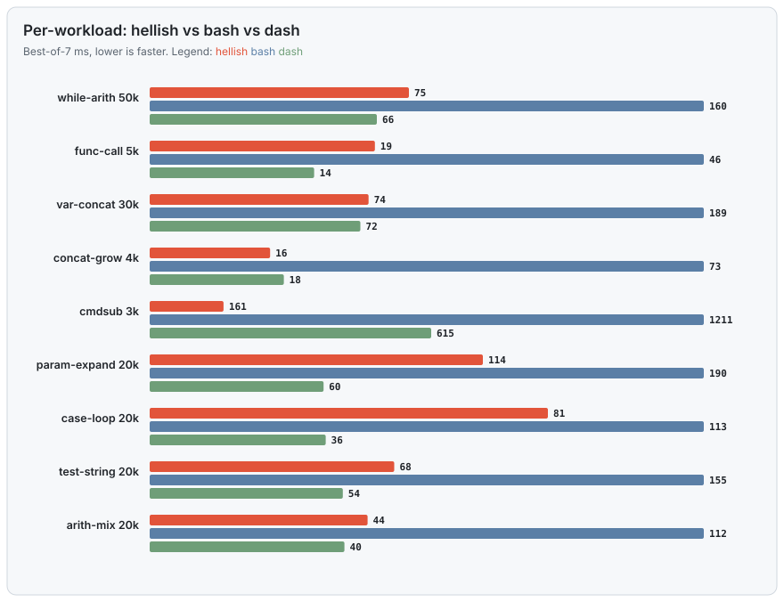

<div align="center">

# hellish 🐚🔥

**A from-scratch, almost-POSIX shell in C — that runs like a minimalist shell and reads like bash.**


*Built as a 42 project by **dlesieur** and **alcacere**, grown well past the school subject.*

</div>

---

`hellish` is engineered like a teaching lab and benchmarked like a production
shell: `input → lexer → parser → word reparser → heredoc → expander → executor`,
each a small readable module, one `t_shell` struct as the single source of
truth. It diffs **byte-for-byte against `bash --posix`** on thousands of cases,
runs clean under AddressSanitizer, and ships **two allocators you swap at
compile time** (libc `malloc` or our own `ft_malloc`).

But the reason this README leads with numbers: **it's fast.** Not "fast for a
student project" — fast against the shells you actually use.

---

## 🏁 The headline: a 9-shell race

We build hellish plus a zoo of real shells — **bash, dash, zsh, mksh, ksh,
yash, busybox ash, fish** — into one Docker image and race all nine on 17
portable POSIX workloads (`make agnostic-bench`). Ranking is the **geometric
mean** of the best-of-7 time on each workload, so no single benchmark can skew
it and warm-up noise is thrown away.


<div align="center">

### 🥉 hellish ranks **#3 of 9**

</div>

| # | shell | geomean | vs hellish | |
|:---:|:---|---:|:---:|:---|
| 1 | ksh | 36.9 ms | 0.55× | *builtin-accelerated ¹* |
| 2 | dash | 51.4 ms | 0.77× | the minimalist speed king |
| **3** | **hellish** | **66.6 ms** | **1.00×** | ◀ **us** |
| 4 | busybox ash | 72.8 ms | 1.09× | |
| 5 | zsh | 114.1 ms | 1.71× | hellish is **1.7× faster** |
| 6 | bash | 139.1 ms | 2.09× | hellish is **2.1× faster** |
| 7 | mksh | 151.1 ms | 2.27× | |
| 8 | yash | 185.6 ms | 2.79× | |
| 9 | fish | 742.0 ms | 11.14× | |

**The honest summary:** hellish is **faster than 6 of the 8 other shells** —
including **bash** (2.1×) and every feature-rich shell (zsh, fish) — and lands
just behind the two shells built to be minimal and nothing else. And it does
this while carrying a **bash-class feature surface** those minimalist shells
don't have (arrays, `[[ =~ ]]`, `${v/p/r}`, process substitution, job control,
vi/emacs editing). *That combination — minimalist speed, bash features — is the
whole point.*

> ¹ ksh93's #1 is partly an artifact: its recursion (`fib18` 54.6 ms vs
> everyone else's 2.4–4.8 **seconds**) and command-substitution rows are orders
> of magnitude off the field because ksh compiles/forklessly accelerates them —
> not comparable work. On the ordinary workloads it and hellish trade blows.

---

## 📊 Where hellish wins, ties, and loses

No cherry-picking. Per-workload, best-of-7, lower is faster:



**vs `bash`** — hellish wins nearly everywhere it's tested:

| area | hellish | bash | verdict |
|---|---|---|:---:|
| arithmetic loops | 75 ms | 161 ms | ✅ **2.1× faster** |
| string concat (grow) | 16 ms | 73 ms | ✅ **4.6× faster** |
| variable concat | 75 ms | 189 ms | ✅ **2.5× faster** |
| command substitution | 161 ms | 1211 ms | ✅ **7.5× faster** |
| `test`/`[ ]` string ops | 69 ms | 155 ms | ✅ **2.3× faster** |
| function calls | 19 ms | 47 ms | ✅ **2.5× faster** |
| parse a 50k-line script | 55 ms | 75 ms | ✅ **1.4× faster** |

**vs `dash`** — the honest losses. dash is a tiny POSIX-only shell; matching it
is the goal, not always reached:

| area | hellish | dash | verdict |
|---|---|---|:---:|
| arithmetic loops | 75 ms | 66 ms | ≈ within 15% |
| command substitution | 161 ms | 615 ms | ✅ **3.8× faster** |
| `read` loop | 125 ms | 724 ms | ✅ **5.8× faster** |
| function calls | 19 ms | 14 ms | ➖ dash faster |
| parameter expansion | 114 ms | 60 ms | ➖ dash faster |
| parse a 50k-line script | 55 ms | 29 ms | ➖ dash faster |

So: **hellish beats dash on the fork- and I/O-heavy work** (command
substitution, read loops) and trails it on the pure-parse and pure-expansion
micro-loops, where dash's do-almost-nothing design is hard to beat.

---

## 🧠 Memory

Peak resident set, median of 7 runs (`make rss`). hellish keeps a **flat ~4 MB
working set** on loops — competitive with bash, sometimes tighter — and pays for
its richer parser only where it parses a lot:

| workload | hellish | bash | dash |
|---|---:|---:|---:|
| startup | 3.9 MB | 3.8 MB | **2.2 MB** |
| arith loop | **3.8 MB** | 3.9 MB | 2.2 MB |
| string concat | **3.9 MB** | 4.1 MB | 2.2 MB |
| read loop | 3.9 MB | 3.9 MB | 2.2 MB |
| parse 50k lines | 11.6 MB | **4.9 MB** | 2.2 MB |

The parse-50k line is our one real memory cost: the lexer materialises the
whole file's tokens up front. It's down from **158 MB → 20 MB → 11.6 MB** over
successive rounds (8-byte deque tokens, a borrowed input buffer); the remaining
gap to bash is documented and the pull-lexer that closes it is planned in
[`backlog.md`](backlog.md).

---

## ✅ Conformance — more POSIX than dash

Two independent third-party suites, run against `bash --posix` **and** `dash`
(`make conformance`). hellish's rate is deliberately **conservative** — the Oils
harness credits a "known-ok" annotation that exists for bash/dash but cannot
exist for a shell it's never heard of, so we only ever count a hard `pass`.

**mksh `check.t`** (the ksh regression suite) — hellish now **beats dash**:

| shell | passed |
|---|---:|
| bash | 292 |
| **hellish** | **218** 🎉 |
| dash | 216 |

**Oils spec suite** (1622 cases spanning bash + POSIX features):

| shell | hard passes | pass-rate |
|---|---:|---:|
| bash --posix | 1311 | 85.1% |
| dash | 977 | 68.5% |
| **hellish --posix** | **1071** | **66.0%** ᶜᵒⁿˢᵉʳᵛᵃᵗⁱᵛᵉ |

hellish sits between dash and bash on raw Oils count — but Oils tests a pile of
bash-isms dash simply lacks, so on the **shared POSIX core** hellish is much
closer to bash than the headline number suggests, and it already **passes more
of the ksh suite than dash does**.

---

## 🏆 So where does hellish rank, today?

<div align="center">

| dimension | tier | who's ahead |
|---|:---:|---|
| **Speed** | 🥉 top-3 of 9 | only ksh & dash (both minimalist specialists) |
| **vs bash specifically** | ✅ faster | hellish wins ~2× on the geomean |
| **Features** | high | far beyond dash/busybox/mksh; near bash/zsh |
| **Memory** | good | flat ~4 MB; heavier only on big parses |
| **POSIX conformance** | solid | ahead of dash on mksh, behind bash overall |

</div>

**The one-line placement:** *hellish is a top-tier-fast shell that behaves like
bash.* Nothing else in the field pairs dash-adjacent speed with bash-class
features — the minimalist shells (dash, busybox, mksh) are fast but bare, and
the featureful ones (bash, zsh, fish) are slower. hellish sits in the empty
quadrant between them.

*Every number above is measured, not asserted.* Reproduce it:

```sh
make agnostic-bench     # the 9-shell Docker race (needs docker; installs the shells for you)
make rss conformance    # memory + the two conformance suites
make charts             # redraw every SVG on this page from the raw artifacts
```

Fairness rules and the measurement traps this harness has already fallen into
(uutils-`timeout` quantization, ASan builds sneaking into a benchmark) are
documented honestly in [`bench/METHODOLOGY.md`](bench/METHODOLOGY.md).

---

## 🚀 Quick start

```sh
git clone --recursive https://github.com/Univers42/hellish && cd hellish
make OPT=1            # optimized build (the one you'll want day to day)
./build/bin/hellish   # drop into the shell
```

`--recursive` matters: hellish pulls in two submodules,
[`vendor/libft`](vendor/libft) (stdlib + the `ft_malloc` allocator) and
`vendor/scripts` (dev tooling). If you forgot it:

```sh
git submodule update --init --recursive
```

---

## 📦 Install

**From source (recommended, always works):**

```sh
git clone --recursive https://github.com/Univers42/hellish && cd hellish
make OPT=1 all && ./build/bin/hellish
```

**Prebuilt binary (curl one-liner)** — fetches the latest release into `$PREFIX`
(default `/usr/local/bin`, falling back to `~/.local/bin`):

```sh
curl -fsSL https://raw.githubusercontent.com/Univers42/hellish/main/install.sh | sh
```

**npm / pnpm / yarn** — the package is `hellish-shell`; its `postinstall`
downloads the matching release binary:

```sh
npm install -g hellish-shell      # or: pnpm add -g hellish-shell
```

**Docker (easiest way to try it)** — a prebuilt image, no toolchain, nothing to
compile:

```sh
docker run --rm -it dlesieur/hellish-shell        # latest
```

Prefer to **build from source in a clean container**? Every supported
platform has a rung — glibc and musl, gcc and clang, five package managers:

```sh
docker compose run --rm alpine     # interactive hellish on Alpine/musl
make docker-test                   # build + run the portability smoke on ALL of them
make smoke                         # ... or just run that smoke against a local build
```

| | rungs |
|---|---|
| glibc | `ubuntu` (24.04), `ubuntu2204`, `debian`, `arch`, `fedora`, `rocky`, `opensuse`, `void` |
| musl | `alpine`, `alpine-clang`, `alpine-ftmalloc` |
| compilers | gcc (11 → current) and clang, on both libcs, `-Werror` throughout |
| architectures | x86_64 and arm64 (native runner in CI) |

macOS and WSL are covered by the `Platforms` workflow rather than Docker —
Apple's kernel cannot legally or practically run in a container, and WSL's
whole point is the Windows bridge a container does not have. Both are
**informational** today; see [wiki/platforms.md](wiki/platforms.md) for what
works and what does not.

Once installed, hellish checks for newer releases in the background (once a day,
never blocking the prompt — the check is a detached child, so a slow or dead
release server costs your shell nothing). When one is waiting you are told twice
and unprompted: the welcome panel announces it once, and the prompt carries a
quiet `⬆2.7.4` badge until you actually update. `update` checks on demand,
`update --now` self-updates.

Knobs: `HELLISH_BANNER=0|1` forces the welcome panel off or on
(`HELLISH_NO_BANNER=1` and `HELLISH_ALWAYS_BANNER=1` are the older names and
still work); `HELLISH_NO_UPDATE_CHECK=1` disables the check and the badge.

---

## 🛠 Build & the SAFE / OPT matrix

Two independent knobs shape the build: **`OPT`** (optimization) and **`SAFE`**
(which allocator). They combine freely, and the build banner announces the
active allocator so it's never a surprise.

| Command | Optimization | Allocator | Sanitizers | Use it for |
|---|---|---|---|---|
| `make all` | `-O0 -g3` | libc (`SAFE=1`) | ASan + LeakSanitizer | dev, debugging, leak hunts |
| `make OPT=1` | `-O3 -flto` | **`ft_malloc`** (`SAFE=0`) | none | speed, benchmarks, daily driving |
| `make SAFE=0` | `-O0 -g3` | `ft_malloc` | ASan | the custom heap under a debugger |
| `make OPT=1 SAFE=1` | `-O3 -flto` | libc | none | optimized build on the battle-tested heap |

An explicit `SAFE=…` on the command line always wins. libft compiles into a
**per-`SAFE` tree** (`build-libc` vs `build-ft`) so the two allocators never
share objects — flip `SAFE`, get the right archive, not a stale one.

```sh
make            # what you can ask for — the self-documenting help page
make all        # debug build  -> build/bin/hellish
make OPT=1      # optimized build
make re         # fclean + rebuild
make test       # full suite: thousands of golden-diff cases vs bash --posix
make norm       # 42 norminette over src/ incs/ tests/
make my_shell   # install as your login shell (rebuilds OPT=1 SAFE=1 first)
```

### Making it your shell without root

`make my_shell` needs sudo twice over: to write `/usr/bin`, and because
`chsh` refuses any shell that is not listed in `/etc/shells` — a file only
root can edit. On a lab machine or a shared server that route is closed.

```sh
make user-install     # ~/.local/bin + an exec hook in your login shell's rc
make user-uninstall   # put everything back
```

`user-install` installs into `~/.local/bin`, seeds `~/.hellishrc` from
`hellishrc.example` (never overwriting one you already have), and appends a
marker-delimited block to your login shell's rc file that `exec`s hellish for
interactive sessions. `exec` *replaces* the process, so this is a real login
shell and not an alias or a wrapper: `ps` shows hellish, `$$` is hellish, and
closing it closes the tab.

Your passwd entry is never touched, which keeps `ssh host 'cmd'` working and
leaves you a guaranteed way back in. The installed binary is smoke-tested
*before* the hook is written, so a bad build can never leave you with
terminals that die on open. Escape hatches, in increasing permanence:
`HELLISH_NO_EXEC=1` for one session, `touch ~/.hellish-disable` for all of
them, `make user-uninstall` to remove the block.

Knobs: `PREFIX=~/opt`, `RC_TARGET=~/.bashrc`, `STATIC=1` (install the
docker-built static binary instead of compiling here).

---

## 🐚 What it can do

**Interactive** — vi & emacs line editing (readline), persistent de-duplicated
history with multi-line-safe escaping (`history`, `fc`, `!`-expansion), tab
completion for commands / files / `$variables`, a multibyte- and ANSI-aware
prompt (user, cwd, git branch, venv, time) that never drifts the cursor, a
`~/.hellishrc` startup file, and job control (`&`, `jobs`, `fg`, `bg`, `wait`,
`kill`, `$!`).

**Scripting / POSIX** — pipelines and lists (`;`, `&&`, `||`, `&`), subshells,
brace groups; `if/elif/else`, `for`, `while`, `until`, `case/esac`, and
**functions** (`local`, `return`, recursion); every redirection including
here-docs `<<`/`<<-` and **process substitution** `<( )` / `>( )`; the full
expansion pipeline in classic order — brace, tilde, parameter
(`${v:-d}` `${v#p}` `${v%p}` **`${v/p/r}`**), command `$( )` / `` `…` ``,
arithmetic `$(( ))`, `IFS` word splitting, globbing (`*` `?` `[…]` POSIX
classes); positional params, `shift`, `getopts`, `set -o` options, `trap`,
`[[ … ]]`, arrays, `let`.

**Builtins (47):** `echo export cd pushd popd dirs [[ exit pwd env unset type
set shift : break continue eval . source true false umask command return getopts
exec wait times trap readonly read test [ alias unalias hash jobs fg bg fc
history let local kill printf ulimit update`.

---

## 🧬 The two allocators (SAFE)

Every allocation in hellish goes through one `xmalloc`/`xfree` macro family that
resolves **at compile time** to libc `malloc` or our own `ft_malloc` — no
pointer ever crosses heaps. So you can A/B the exact same shell on two
completely different allocators and prove they produce byte-identical output:

```sh
cd tests && ./verify_alloc.sh   # builds BOTH heaps, proves output parity + zero leaks
```

`ft_malloc` (in the `vendor/libft` submodule) is a slab + big-alloc allocator
with an O(1) free path; on `SAFE=0` its own live-bytes oracle
(`HELLISH_ALLOC_STATS=1`) replaces ASan as the leak gate.

---

## 🏗 Architecture in one breath

`main → on() → repl_shell() → parse_and_execute_input()`. The lexer slices
tokens straight out of the input buffer (no copies); the parser builds a
`t_ast_node` tree that **deliberately keeps raw tokens** so loops and functions
re-expand each iteration without re-parsing; the expander runs **lazily,
per-simple-command**, during the executor's tree walk. Heredocs are gathered in
a pre-exec pass; command substitution has a forkless fast path for provably
side-effect-free bodies. Each module under [`src/`](src) has its own `README.md`.

---

## 🔬 Testing & quality gates

Nothing lands without all of these green from a clean tree:

- **`make test`** — thousands of cases, each diffed (stdout + exit status +
  files written) against `bash --posix`.
- **`tests/run_scripts.sh`** — whole real programs vs `bash --posix`.
- **`cd tests && ./verify_alloc.sh`** — output parity + zero leaks on **both** heaps.
- **`make conformance`** — Oils spec + mksh `check.t`, gated so a pass-count drop fails.
- **`make readline-test` / `make hist-test`** — real-pty coverage of the interactive
  paths the `-c` suite can't reach.
- **`make norm`** — 42 norminette clean.

---

## 🤝 Contributing

Branch from `develop`; PRs target `develop` (`main`/`develop` are protected).
Conventional Commits, enforced by a hook. Every fix ships with a test —
non-negotiable. See [`CONTRIBUTING.md`](CONTRIBUTING.md) and
[`CLAUDE.md`](CLAUDE.md) for the house rules (42 Norm, allocator discipline,
the test model).

## 📄 License

[MIT](LICENSE) — © the hellish authors.
