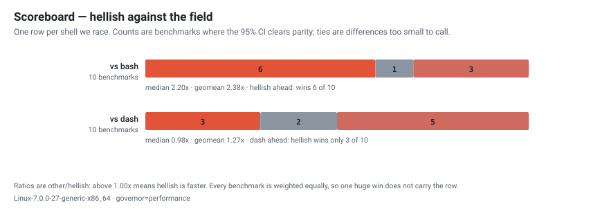
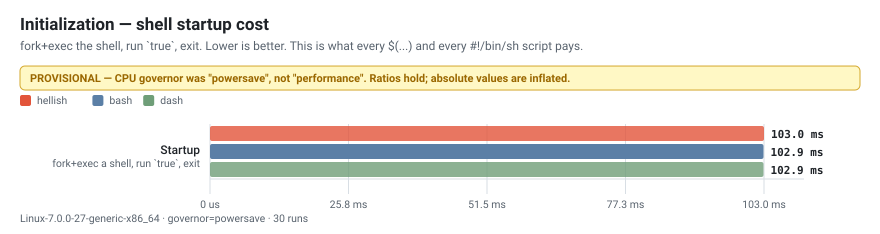
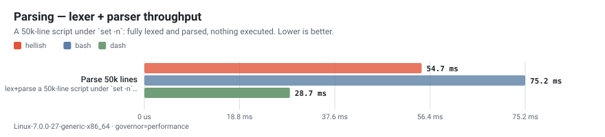
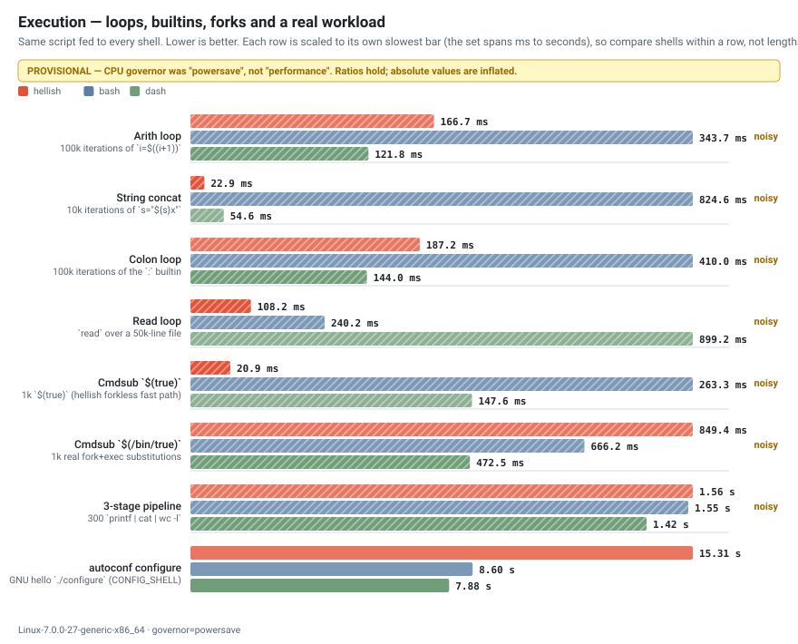
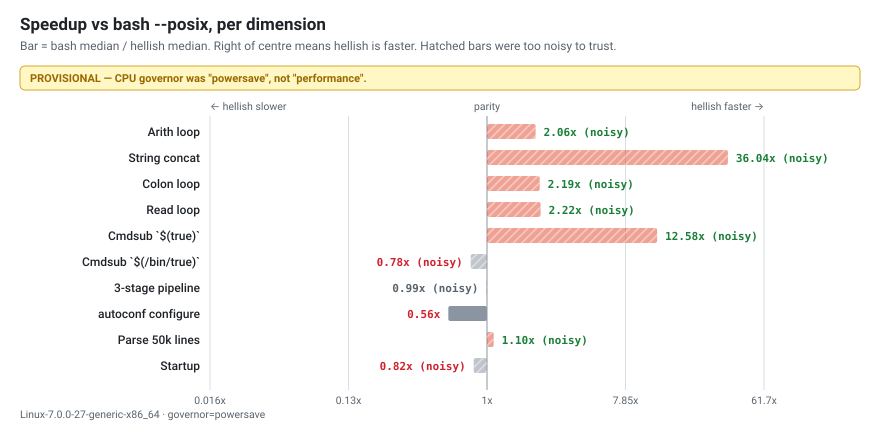
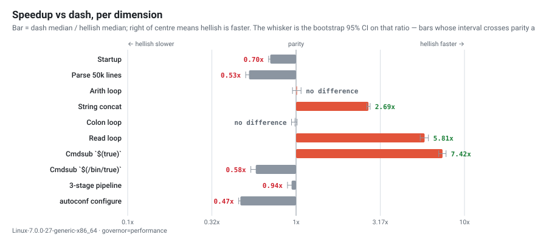
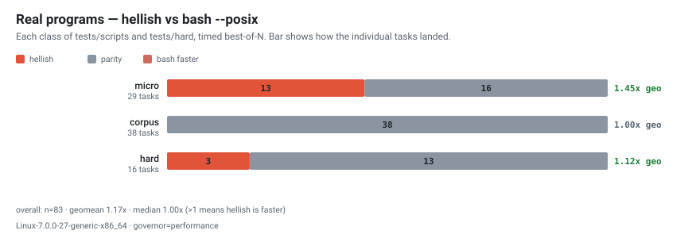
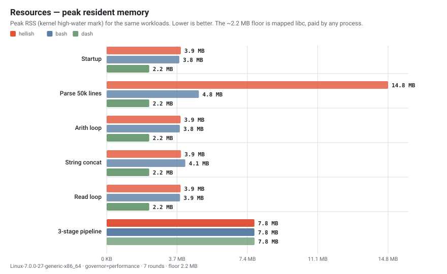
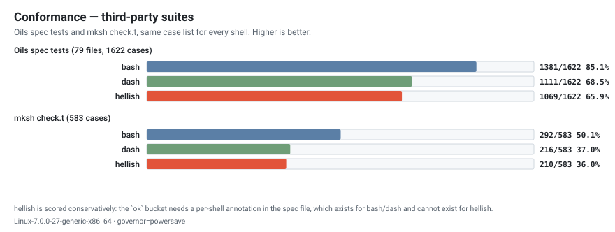

# hellish 🐚🔥

> A from-scratch, almost-POSIX shell written in C — fast, hackable, and pleasant
> to use every day. Built as a 42 project by **dlesieur** and **alcacere**, but
> grown well past the school subject.

`hellish` reads like a real shell (pipelines, redirects, here-documents,
subshells, process substitution, job control, functions, arithmetic, globbing,
parameter expansion) and is engineered like a teaching lab: input → lexer →
parser → word reparser → heredoc → expander → executor, each a small, readable
module. It ships with **two allocators you can swap at compile time** (libc
`malloc` or our own `ft_malloc`) so you can A/B their behaviour and speed.

- **Latest:** v2.3.2 (stable) — the full PR CI pipeline is green end-to-end
  (build matrix, submodules, the ~2481 suite, script corpus, leaks, norm) and
  the four-distro Docker build verifies on every push. Builds on v2.3.1:
  heredocs nested in compound commands, `type`/`hash` parity with bash, a
  reliable `wait`, the multi-distro Docker harness, and a norm-clean tree.

---

## Table of contents

- [Quick start](#quick-start)
- [Install](#install)
- [Build & the SAFE / OPT matrix](#build--the-safe--opt-matrix)
- [What it can do](#what-it-can-do)
- [Performance & conformance](#performance--conformance)
- [The two allocators (SAFE)](#the-two-allocators-safe)
- [Run it your way](#run-it-your-way)
- [Make it your login shell](#make-it-your-login-shell)
- [Architecture in one breath](#architecture-in-one-breath)
- [Testing & quality gates](#testing--quality-gates)
- [Contributing](#contributing)
- [License](#license)

---

## Quick start

```sh
git clone --recursive https://github.com/Univers42/hellish && cd hellish
make OPT=1            # optimized build (the one you'll want day to day)
./build/bin/hellish   # drop into the shell
```

`--recursive` matters: `hellish` pulls in two git submodules,
[`vendor/libft`](vendor/libft) (the standard-lib + the `ft_malloc` allocator)
and `vendor/scripts` (dev tooling). If you forgot it:

```sh
git submodule update --init --recursive
```

---

## Install

All three prebuilt paths download the same `hellish-linux-x86_64` artifact that
the release CI builds and attaches to each GitHub Release, so they only work
**once a release is published** (Linux x86-64). The from-source path always
works.

**From source (recommended, always works):**

```sh
git clone --recursive https://github.com/Univers42/hellish && cd hellish
make OPT=1 all && ./build/bin/hellish
```

**Prebuilt binary (curl one-liner):** fetches the latest release binary into
`$PREFIX` (default `/usr/local/bin`, falling back to `~/.local/bin`).

```sh
curl -fsSL https://raw.githubusercontent.com/Univers42/hellish/main/install.sh | sh
```

**npm / pnpm / yarn:** the package is `hellish-shell`; its `postinstall`
downloads the matching release binary. This works once the package is published
to the npm registry (the release workflow publishes it when the maintainer's
`NPM_TOKEN` secret is set).

```sh
npm install -g hellish-shell      # or: pnpm add -g hellish-shell
```

**Docker (the easiest way to try it):** a prebuilt image is published to Docker
Hub — no toolchain, no `readline/readline.h: No such file`, nothing to compile:

```sh
docker run --rm -it dlesieur/hellish-shell        # latest
docker run --rm -it dlesieur/hellish-shell:2.3.2  # a pinned version
```

Prefer to **build from source in a clean container** (and verify it compiles on
your distro of choice)? The repo ships a `docker-compose.yml` that builds
hellish on four distros (Alpine/musl, Debian, Ubuntu, Arch):

```sh
docker compose run --rm alpine     # interactive hellish on Alpine (or: debian, ubuntu, arch)
make docker-test                   # build + smoke-test hellish on ALL four distros
make docker-build                  # just build the four images
make docker-clean                  # remove them
```

(The root [`Dockerfile`](Dockerfile) is the lean binary-only release image;
[`docker/`](docker/) holds the build-from-source, multi-distro setup.)

Once installed, `hellish` checks for newer releases in the background (once a
day, never blocking the prompt) and flags one in the welcome banner. Run
`update` to check on demand, or `update --now` to self-update the binary. Opt
out with `HELLISH_NO_UPDATE_CHECK=1` (and `HELLISH_NO_BANNER=1`).

---

## Build & the SAFE / OPT matrix

Everything goes through the root `Makefile`. Two independent knobs shape the
build: **`OPT`** (optimization) and **`SAFE`** (which allocator). They combine
freely, and the build prints which allocator it picked so it's never a surprise.

| Command | Optimization | Allocator | Sanitizers | Use it for |
|---|---|---|---|---|
| `make` | `-O0 -g3` | libc (`SAFE=1`) | ASan + LeakSanitizer | day-to-day dev, debugging, leak hunts |
| `make OPT=1` | `-O3 -flto` | **`ft_malloc`** (`SAFE=0`) | none | speed, benchmarks, daily driving |
| `make SAFE=0` | `-O0 -g3` | `ft_malloc` | ASan | exercising the custom heap under a debugger |
| `make OPT=1 SAFE=1` | `-O3 -flto` | libc | none | optimized build on the battle-tested heap |

So the **default per mode** is: debug → `SAFE=1` (libc, so ASan stays
meaningful), optimized → `SAFE=0` (our `ft_malloc`). An explicit `SAFE=…` on the
command line always wins.

Common targets (all repeatable, all idempotent):

```sh
make            # debug build  -> build/bin/hellish
make OPT=1      # optimized build
make re         # fclean + rebuild
make clean      # remove object files
make fclean     # remove objects, binary, and libft build trees
make test       # run the full test suite (diffs hellish vs bash --posix)
make bench      # benchmark hellish vs bash --posix (geomean + per-task)
make norm       # run norminette over src/ incs/ tests/
make my_shell   # install as your login shell (rebuilds OPT=1 SAFE=1 first)
```

libft is compiled into a **per-`SAFE` tree** (`vendor/libft/build-libc` vs
`build-ft`) so the two allocators never share object files — flip `SAFE` and you
get the right archive, not a stale one.

---

## What it can do

**Interactive**
- Line editing with **vi** and **emacs** modes (readline-backed).
- Persistent, de-duplicated command history in `$HOME`, with safe escaping for
  multi-line commands; `history`, `fc`, and `!`-style history expansion.
- Tab completion for commands, files, and `$variables`.
- Rich, multibyte- and ANSI-aware prompt (user, cwd, git branch, venv, time)
  that never drifts the cursor.
- A `~/.hellishrc` startup file (the `.bashrc` analogue) sourced only in
  interactive sessions.
- Job control: `&`, `jobs`, `fg`, `bg`, `wait`, `kill`, `$!`.

**Scripting / POSIX**
- Pipelines, lists (`;`, `&&`, `||`, `&`), subshells `( … )`, brace groups.
- Control flow: `if/elif/else`, `for`, `while`, `until`, `case/esac`, and
  shell **functions** (with `local`, `return`, recursion).
- Redirections: `>`, `>>`, `<`, `>|`, `<>`, `n>&m`, here-documents `<<` / `<<-`,
  and **process substitution** `<( … )` / `>( … )`.
- The full expansion pipeline in classic order: brace expansion, tilde `~`,
  parameter expansion (`${v:-d}`, `${v:=d}`, `${v:?}`, `${v:+a}`, `${#v}`,
  `${v#p}`/`${v##p}`/`${v%p}`/`${v%%p}`, and **`${v/p/r}` / `${v//p/r}`**
  substitution), command substitution `$( … )` and `` `…` ``, arithmetic
  `$(( … ))`, word splitting on `IFS`, and pathname globbing (`*`, `?`,
  `[…]`, POSIX classes).
- Positional parameters `$1 … $@ $* $#`, `shift`, `getopts`, `set` / `set -o`
  options (`-e`, `-u`, `-x`, `-f`, `-C`, `-a`, `-n`, …), `$?`, `$$`, `$-`.
- `trap` (including `EXIT` and signal traps), `[[ … ]]`, arithmetic `let`.

**Builtins** (47): `echo export cd pushd popd dirs [[ exit pwd env unset type set
shift : break continue eval . source true false umask command return getopts
exec wait times trap readonly read test [ alias unalias hash jobs fg bg fc
history let local kill printf ulimit update`.

---

## Performance & conformance

Every number and every chart on this page is generated, not written by hand:
the harnesses in [`bench/`](bench/) produce the raw artifacts, `make charts`
renders them. Nothing here is a claim we can't reproduce on your machine with
two commands.

```sh
make perf conformance   # measure  (slow: hyperfine + two third-party suites)
make charts             # draw     (instant, from whatever is on disk)
```

Fairness rules, dimension definitions, and the silent measurement traps this
harness has already fallen into live in
[`bench/METHODOLOGY.md`](bench/METHODOLOGY.md).

### Where we stand



Two different stories, and it's worth being precise about which is which:

- **Against `bash --posix`, hellish is ahead** — currently **6 wins, 1 tie,
  3 losses**, several wins by large multiples, and over the real-program
  corpus it does not lose a single task.
- **Against `dash`, hellish is behind.** dash is a deliberately minimal shell
  — no arrays, no job control, no line editing — and that minimalism shows in
  startup and process creation. It is the honest gap and the one the
  optimization work is aimed at. The loop dimensions have already been pulled
  level; startup, `fork+exec` and `./configure` have not.

A benchmark counts as a win or a loss only when a bootstrap 95% confidence
interval on the ratio clears parity; anything else is reported as *no
difference* rather than being spun as a narrow victory. That is why the
`3-stage pipeline` row (`1.02×`, CI `0.95–1.04`) is a tie and not a win.

### Initialization

What every `$(...)`, every `#!/bin/sh` script and every `make` recipe line pays
before doing any work at all.



hellish starts in ~3 ms: level with bash (`0.96×`) and behind dash (`0.70×`).
The reason is structural and measurable — hellish needs **three** shared
objects at load time (libreadline, libtinfo, libc), bash needs two, dash needs
one, and the dynamic linker relocates all of them before `main()` runs. A
non-interactive `-c` shell never calls a single readline entry point and pays
for it anyway. Startup is charged once per process, so it compounds hardest
exactly where we are weakest: `./configure` spawns thousands of shells.

### Parsing

A generated 50k-line script under `set -n` — fully lexed and parsed, nothing
executed. This isolates the lexer and the recursive-descent parser.



**1.37× bash**, and still a little over half dash's speed (0.53×). This row
moved recently: profiling found the batch scanner running `strncmp` against
`"alias"` and `"source"` on *every byte* of input, and the keyword matcher
calling into libc for 2–5 byte compares. Fixing both cut parse work by a third
(573.5M → 383.5M instructions on this workload), which is what turned a loss to
bash into a win. dash remains ahead and remains the target; the steps so far —
batched input delivery, the parse arena, the 8-byte token deque, and the
predicate-ordering fixes — are logged with their measured effect in
[`backlog.md`](backlog.md).

### Execution

The same script fed to every shell, from tight interpreter loops through fork
workloads to a real `./configure`.



And the same data as speedup ratios — right of centre means hellish is faster.
The whisker on each bar is a bootstrap 95% confidence interval, so you can see
which differences are real and which are the machine talking:





The shape of the result, stated plainly:

- **Where hellish wins big**, it is a real algorithmic difference, not tuning.
  String concatenation is **42× bash** because bash's naive `s="${s}x"` is
  quadratic with an expensive reallocation on every iteration. `$(true)` is
  **15× bash** because hellish proves the body side-effect-free and skips the
  fork entirely — the trick ksh93 is famous for. `read` over a 50k-line file is
  **2.2× bash and 5.8× dash**.
- **Against dash the loops are now level** — arith `1.02×` and colon `0.98×`,
  both confidence intervals straddling parity. They were clear losses (0.80×
  and 0.74×) until the expander learned that `"$VAR"` deserves the same fast
  path as `$VAR`; the quoted form was paying an AST clone and the full
  expansion pipeline to read one variable.
- **Where hellish still loses**, it loses on process creation. Real
  `fork+exec` substitution is `0.81×` bash, and `./configure` is `0.51×`
  (18.9 s against bash's ~9.7 s and dash's ~8.9 s). That row is the clearest
  statement of what is left to do, and the cause is measured rather than
  guessed: hellish spawns **two** processes per `$(…)` where bash and dash
  spawn one, and it loads three shared objects at startup where dash loads
  one. Both are itemised in [`backlog.md`](backlog.md).

### Real programs

Microbenchmarks isolate one thing each; they can't tell you whether the wins
survive contact with a program. `make bench` runs the whole of
[`tests/scripts/`](tests/scripts) and [`tests/hard/`](tests/hard) — real POSIX
programs, 100–500 lines each — against `bash --posix`, best-of-N, output
verified equal first.



**83 tasks, geometric mean 1.17×, and not one loss.** The distribution matters
more than the average: hellish is meaningfully faster on 16 tasks (averaging
2.2× when it wins) and dead-even on the other 67. "Dead-even on most, much
faster on some, never slower" is a more useful summary than any single number —
and it is why the microbenchmark wins above are worth believing.

### Resources

Speed is half a result. Peak RSS over the same workloads, measured with the
kernel's own high-water mark:



At rest hellish costs about what bash does (~3.9 MB vs ~3.8 MB) against a
~2.2 MB floor that any process pays for mapped libc. Parsing is where the
trade shows: **11.6 MB against bash's 4.9 MB**, the price of the parse arena
that makes the parsing numbers above possible. dash is smaller than both,
everywhere, and makes no apology for it.

### Conformance

Two independent third-party suites — the [Oils spec
tests](https://github.com/oils-for-unix/oils) and mksh's own `check.t` — run
against hellish, `bash --posix` and dash on an identical case list.



hellish sits **roughly at dash's level and clearly behind bash**: 65.9% vs
dash's 68.5% and bash's 85.1% on the Oils corpus. The number that actually
drives work is neither of those — it's the **159 consensus divergences**, the
cases where bash *and* dash agree and hellish disagrees. Those are unambiguous
bugs rather than dialect differences, they are enumerated in
[`bench/conformance.md`](bench/conformance.md), and they are the repair queue.
`make conformance` fails the build if the pass count ever drops.

### A note on these numbers

Everything above was measured on the `performance` CPU governor and carries a
bootstrap 95% confidence interval. If you regenerate on a laptop sitting in
`powersave`, the charts stamp themselves **provisional** — frequency scaling
produces multi-modal timings no number of repetitions averages away — and
`bench/run.sh` will tell you so. To reproduce properly:

```sh
sudo cpupower frequency-set -g performance
make perf && make charts
```

Three separate measurement bugs have been found in this harness, and none of
them threw an error — each simply produced confident, wrong numbers. A
non-GNU `timeout` that reaped on a 100 ms grid (making every sub-second
benchmark a rounding artifact); a half-finished re-run leaving artifacts from
two different branches in one directory; and a shared binary path that let a
`make test` hand the AddressSanitizer build to the benchmark. All three now
fail loudly rather than lying: the harness probes for GNU `timeout`, stamps
every run with a git revision and a completion flag, and refuses outright to
time a binary that links `libasan`. The details are in
[`METHODOLOGY.md`](bench/METHODOLOGY.md), because a benchmark you cannot
distrust correctly is worse than none.

Reported honestly means reported both ways: the wins above are large and
reproducible, and so are the losses on startup, `fork+exec`, `./configure`,
and conformance.

---

## The two allocators (SAFE)

Every allocation in the shell goes through one macro family —
`xmalloc` / `xcalloc` / `xfree` — that resolves **at compile time** to either
libc or our own allocator:

- **`SAFE=1`** → libc `malloc`/`free`. AddressSanitizer and LeakSanitizer
  instrument it, so this is where leak/heap checking is *meaningful*.
- **`SAFE=0`** → **`ft_malloc`**, the custom slab/arena allocator living in
  `vendor/libft`. Faster, and a fun thing to study — but ASan is blind to it, so
  for leak checking on this side use its own oracle:

```sh
make OPT=1                                   # SAFE=0 build
HELLISH_ALLOC_STATS=1 ./build/bin/hellish script.sh   # prints live bytes at exit
```

The two heaps do **not** share memory, so the shell is careful never to free a
pointer on the wrong one. Both backends pass the entire test suite identically —
the swap is transparent to behaviour, only the performance and the debugging
tools differ.

---

## Run it your way

```sh
./build/bin/hellish                 # interactive
./build/bin/hellish script.sh       # run a script file
./build/bin/hellish -c 'echo hi'    # run a command string
echo 'echo piped' | ./build/bin/hellish   # read from a pipe (non-TTY)
```

Debug views (compose them freely):

```sh
./build/bin/hellish --debug=lexer --debug=parser --debug=ast script.sh
```

---

## Make it your login shell

> ⚠️ Only do this if you understand the risk — a broken `$SHELL` makes life
> painful. Keeping it as an *alternative* shell you launch explicitly is safer.

```sh
make my_shell                       # rebuilds OPT=1 SAFE=1, installs, registers
make my_shell BAPTIZE_SHELL=myname  # install under a custom name
```

`my_shell` deliberately rebuilds **`OPT=1 SAFE=1`** (optimized, on the
battle-tested libc heap) before installing — the shell you live in should be the
safe, fast one. Pass `SAFE=0` if you really want the custom heap; then stability
is on you.

**Once you switch, mind your `PATH`.** hellish reads `~/.hellishrc` and nothing
else — never `~/.profile`, which is where your distro appends `~/.local/bin`. So
tools installed there (pipx, `npm -g`, cargo, `pip --user`) become *command not
found* the moment bash stops being your login shell, with nothing pointing at the
cause. [`hellishrc.example`](hellishrc.example) ships the guarded block that puts
them back; copy it across when you copy the rest.

---

## Architecture in one breath

```
input → lexer → parser (AST) → word reparser → heredoc → expander → executor
```

Each stage is its own module under `src/` with its own README, all orbiting one
struct — `t_shell` in [`incs/shell.h`](incs/shell.h), the single source of truth
for a running shell. The codebase is heavily and *humanly* commented: read any
`.c` top-to-bottom and the comments explain the *why*, the trick, and the gotcha,
not just the *what*. See [`CLAUDE.md`](CLAUDE.md) for an architectural map.

---

## Testing & quality gates

```sh
make test                       # the whole suite, hellish vs bash --posix
cd tests && ./tester redir pipe # run specific category files
cd tests && ./verify_alloc.sh   # build BOTH allocators, prove parity + no leaks
make bench                      # speed vs bash --posix (geomean verdict)
make agnostic-bench             # cross-shell speed MATRIX in docker (see below)
make perf                       # dimension-split hyperfine bench + peak RSS
make conformance                # Oils spec + mksh check.t, with a regression gate
make charts                     # redraw bench/charts/*.svg from those artifacts
make norm                       # 42 norminette
```

`make agnostic-bench` answers the broader question — not "faster than bash?" but
"faster than *which* shells?". It builds one self-contained docker image with
hellish plus a zoo of competitors (**bash, dash, zsh, mksh, ksh, yash, busybox
ash, fish**) and races them all on a portable POSIX workload set, then prints a
per-workload matrix and a fastest→slowest ranking that places hellish. Each
shell runs in its own natural mode; bash is the oracle, and any shell whose
output differs for a workload is excluded from that row (only same-answer runs
are ranked). Override with `make agnostic-bench ROUNDS=7 TIMEOUT_S=60`.

The test model is a **golden diff against `bash --posix`**: ~2500 cases compare
stdout, exit status, and any files written, on both allocator backends. The
debug build runs under AddressSanitizer + LeakSanitizer; `verify_alloc.sh`
additionally gates output-parity and leak-cleanliness across `SAFE=1` and
`SAFE=0`.

---

## Contributing

Pull requests welcome — please read [`CONTRIBUTING.md`](CONTRIBUTING.md) first.
In short: **fork, branch, keep the commit format, add a test for every bug you
fix, and make sure `make norm` / the suite / ASan are all green before you open
the PR.** Bugs that live in `vendor/libft` or `ft_malloc` are fixed in *those*
submodule repositories, not here.

Security issues: see [`SECURITY.md`](SECURITY.md). Be excellent to each other:
[`CODE_OF_CONDUCT.md`](CODE_OF_CONDUCT.md).

---

## License

[MIT](LICENSE) © dlesieur, alcacere. An educational project built on the POSIX
shell grammar, *Crafting Interpreters*-style lexing/parsing, and a lot of
late-night debugging. Welcome to `hellish`. 🐚
