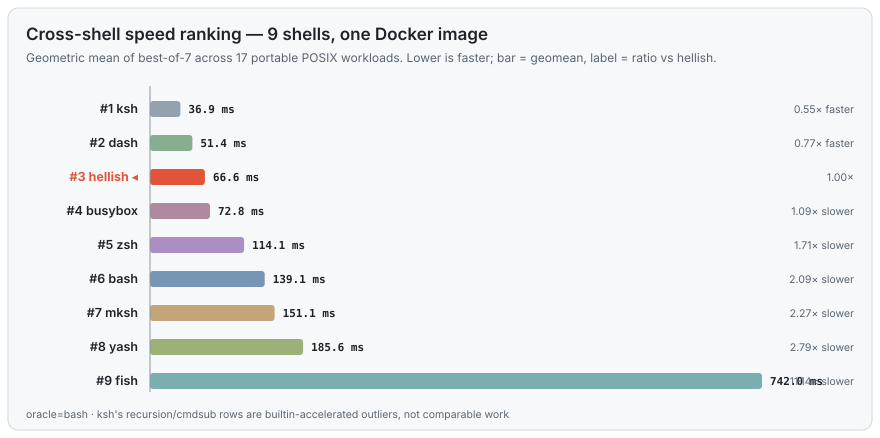

# Benchmarks — the 9-shell race

> Every number on this page is measured, not asserted, and reproducible with
> one command. Fairness rules and the measurement traps this harness has
> already fallen into are documented in
> [`bench/METHODOLOGY.md`](https://github.com/Univers42/hellish/blob/main/bench/METHODOLOGY.md).

We build hellish plus a zoo of real shells — **bash, dash, zsh, mksh, ksh,
yash, busybox ash, fish** — into one Docker image and race all nine on 17
portable POSIX workloads (`make agnostic-bench`). Ranking is the **geometric
mean** of the best-of-7 time on each workload, so no single benchmark can skew
it and warm-up noise is thrown away.



## hellish ranks #3 of 9

| # | shell | geomean | vs hellish | |
|:---:|:---|---:|:---:|:---|
| 1 | ksh | 36.9 ms | 0.55× | *builtin-accelerated ¹* |
| 2 | dash | 51.4 ms | 0.77× | the minimalist speed king |
| **3** | **hellish** | **66.6 ms** | **1.00×** | ◀ **us** |
| 4 | busybox ash | 72.8 ms | 1.09× | |
| 5 | zsh | 114.1 ms | 1.71× | hellish is **1.7× faster** |
| 6 | bash | 139.1 ms | 2.09× | hellish is **2.1× faster** |
| 7 | mksh | 151.1 ms | 2.27× | |
| 8 | yash | 185.6 ms | 2.79× | |
| 9 | fish | 742.0 ms | 11.14× | |

**The honest summary:** hellish is **faster than 6 of the 8 other shells** —
including **bash** (2.1×) and every feature-rich shell (zsh, fish) — and lands
just behind the two shells built to be minimal and nothing else. And it does
this while carrying a **bash-class feature surface** those minimalist shells
don't have (arrays, `[[ =~ ]]`, `${v/p/r}`, process substitution, job control,
vi/emacs editing). *That combination — minimalist speed, bash features — is the
whole point.*

> ¹ ksh93's #1 is partly an artifact: its recursion (`fib18` 54.6 ms vs
> everyone else's 2.4–4.8 **seconds**) and command-substitution rows are orders
> of magnitude off the field because ksh compiles/forklessly accelerates them —
> not comparable work. On the ordinary workloads it and hellish trade blows.

## Where hellish wins, ties, and loses

No cherry-picking. Per-workload, best-of-7, lower is faster:


**vs `bash`** — hellish wins nearly everywhere it's tested:

| area | hellish | bash | verdict |
|---|---|---|:---:|
| arithmetic loops | 75 ms | 161 ms | ✅ **2.1× faster** |
| string concat (grow) | 16 ms | 73 ms | ✅ **4.6× faster** |
| variable concat | 75 ms | 189 ms | ✅ **2.5× faster** |
| command substitution | 161 ms | 1211 ms | ✅ **7.5× faster** |
| `test`/`[ ]` string ops | 69 ms | 155 ms | ✅ **2.3× faster** |
| function calls | 19 ms | 47 ms | ✅ **2.5× faster** |
| parse a 50k-line script | 55 ms | 75 ms | ✅ **1.4× faster** |

**vs `dash`** — the honest losses. dash is a tiny POSIX-only shell; matching it
is the goal, not always reached:

| area | hellish | dash | verdict |
|---|---|---|:---:|
| arithmetic loops | 75 ms | 66 ms | ≈ within 15% |
| command substitution | 161 ms | 615 ms | ✅ **3.8× faster** |
| `read` loop | 125 ms | 724 ms | ✅ **5.8× faster** |
| function calls | 19 ms | 14 ms | ➖ dash faster |
| parameter expansion | 114 ms | 60 ms | ➖ dash faster |
| parse a 50k-line script | 55 ms | 29 ms | ➖ dash faster |

So: **hellish beats dash on the fork- and I/O-heavy work** (command
substitution, read loops) and trails it on the pure-parse and pure-expansion
micro-loops, where dash's do-almost-nothing design is hard to beat.

## Memory

Peak resident set, median of 7 runs (`make rss`). hellish keeps a **flat ~4 MB
working set** on loops — competitive with bash, sometimes tighter — and pays for
its richer parser only where it parses a lot:

| workload | hellish | bash | dash |
|---|---:|---:|---:|
| startup | 3.9 MB | 3.8 MB | **2.2 MB** |
| arith loop | **3.8 MB** | 3.9 MB | 2.2 MB |
| string concat | **3.9 MB** | 4.1 MB | 2.2 MB |
| read loop | 3.9 MB | 3.9 MB | 2.2 MB |
| parse 50k lines | 11.6 MB | **4.9 MB** | 2.2 MB |

The parse-50k line is our one real memory cost: the lexer materialises the
whole file's tokens up front. It's down from **158 MB → 20 MB → 11.6 MB** over
successive rounds (8-byte deque tokens, a borrowed input buffer); the remaining
gap to bash is documented and the pull-lexer that closes it is planned in
[`backlog.md`](https://github.com/Univers42/hellish/blob/main/backlog.md).

## Conformance — more POSIX than dash

Two independent third-party suites, run against `bash --posix` **and** `dash`
(`make conformance`). hellish's rate is deliberately **conservative** — the Oils
harness credits a "known-ok" annotation that exists for bash/dash but cannot
exist for a shell it's never heard of, so we only ever count a hard `pass`.

**mksh `check.t`** (the ksh regression suite) — hellish now **beats dash**:

| shell | passed |
|---|---:|
| bash | 292 |
| **hellish** | **218** 🎉 |
| dash | 216 |

**Oils spec suite** (1622 cases spanning bash + POSIX features):

| shell | hard passes | pass-rate |
|---|---:|---:|
| bash --posix | 1311 | 85.1% |
| dash | 977 | 68.5% |
| **hellish --posix** | **1071** | **66.0%** ᶜᵒⁿˢᵉʳᵛᵃᵗⁱᵛᵉ |

hellish sits between dash and bash on raw Oils count — but Oils tests a pile of
bash-isms dash simply lacks, so on the **shared POSIX core** hellish is much
closer to bash than the headline number suggests, and it already **passes more
of the ksh suite than dash does**.

## So where does hellish rank, today?

| dimension | tier | who's ahead |
|---|:---:|---|
| **Speed** | 🥉 top-3 of 9 | only ksh & dash (both minimalist specialists) |
| **vs bash specifically** | ✅ faster | hellish wins ~2× on the geomean |
| **Features** | high | far beyond dash/busybox/mksh; near bash/zsh |
| **Memory** | good | flat ~4 MB; heavier only on big parses |
| **POSIX conformance** | solid | ahead of dash on mksh, behind bash overall |

**The one-line placement:** *hellish is a top-tier-fast shell that behaves like
bash.* Nothing else in the field pairs dash-adjacent speed with bash-class
features — the minimalist shells (dash, busybox, mksh) are fast but bare, and
the featureful ones (bash, zsh, fish) are slower. hellish sits in the empty
quadrant between them.

## Reproduce it

```sh
make agnostic-bench     # the 9-shell Docker race (needs docker; installs the shells for you)
make rss conformance    # memory + the two conformance suites
make charts             # redraw every SVG on this page from the raw artifacts
```

See also: **[Performance & Robustness](performance.md)** ·
**[Architecture](architecture.md)**
