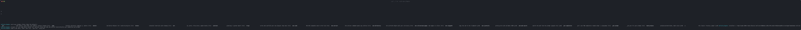
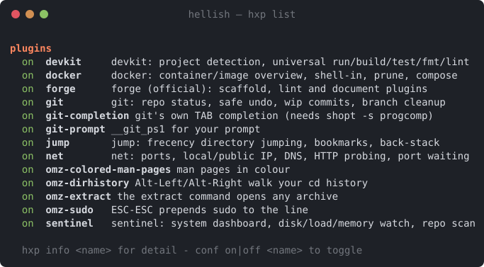
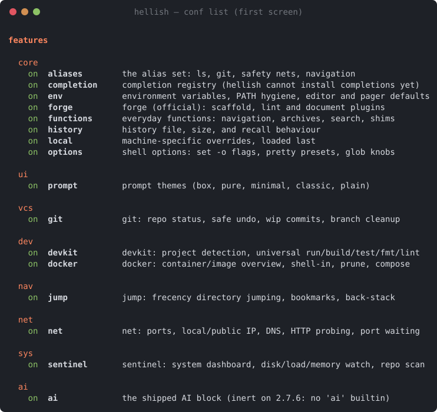
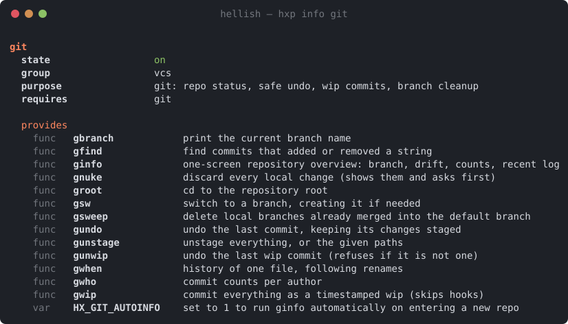
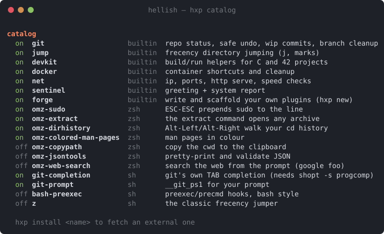
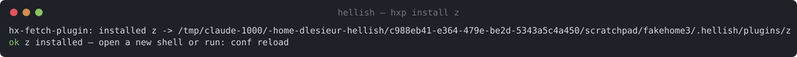

# Plugins

> hellish runs **real third-party plugins** — oh-my-zsh's, git's own scripts,
> bash-preexec, z — and ships a plugin framework of its own with a catalog,
> a manager (`hxp`), and per-feature toggles (`conf`). This page is the
> user's tour; every screenshot below is real output, regenerated from the
> live shell.

## Getting the framework

The easiest moment is install time — the one-liner offers it and lets you
pick plugins one by one (Enter takes the default):

```sh
curl -fsSL https://raw.githubusercontent.com/Univers42/hellish/main/install.sh | sh
```



Already installed hellish? The framework stands alone:

```sh
git clone https://github.com/Univers42/hellishrc_plugins && cd hellishrc_plugins
sh install.sh                    # interactive picker, as above
sh install.sh --plugins all      # everything the catalog defaults on
sh install.sh --plugins "git jump omz-sudo"
```

Your existing `~/.hellishrc` is never eaten: it is preserved as
`~/.hellish/rc.d/95-previous-rc.hsh` — still loaded, after the framework,
exactly as before — plus a timestamped backup beside the original.

## What you get

Open a new shell and ask it:



`conf` is the wider switchboard — plugins *and* the framework's own modules
(aliases, history, prompt, completion…), all persisted in
`~/.hellish/hellish.conf`:



Everything is documented from inside: `hxp info <name>` shows what a plugin
provides, needs, and whether anything is missing on this machine:



## The catalog — and installing more

`hxp catalog` shows everything installable, installed or not. The externals
are the plugins hellish's own test corpus proves on every CI run:



Installing one is one command — fetched, wrapped, and toggleable like any
other plugin:



| | plugins |
|---|---|
| **builtin** (ship with the framework) | `git` `jump` `devkit` `docker` `net` `sentinel` `forge` |
| **oh-my-zsh** (fetched, run through the zsh dialect) | `omz-sudo` `omz-extract` `omz-dirhistory` `omz-colored-man-pages` `omz-copypath` `omz-jsontools` `omz-web-search` |
| **classics** (plain sh/bash) | `git-completion` `git-prompt` `bash-preexec` `z` |

A fetched `.zsh` file keeps its extension — sourcing a `.zsh` path is what
arms hellish's [zsh dialect](architecture.md#the-zsh-dialect) for that file,
so a real oh-my-zsh plugin parses as zsh without any shim. Installing
`git-completion` also arms `shopt -s progcomp`, because choosing a
completion plugin *is* answering that question.

## Daily driving

```
conf list                what is on and off       conf on|off <name>
conf doctor              anything wrong with the load
help_conf                every alias, function, variable and option, documented
hxp list                 installed plugins        hxp info <name>
hxp catalog              everything installable
hxp install <name>       fetch an external plugin
hxp remove <name>        delete a fetched one
hxp update [name]        re-fetch one, or every external
hxp doctor               missing external dependencies
```

Toggles persist (`hellish.conf`); a disabled plugin costs one line at load.

## Writing your own

A plugin is `~/.hellish/plugins/<name>/plugin.hsh` whose first executable
line is the contract:

```sh
hx_plugin <name> <on|off> <group> "one-line description" || return 0
```

After that line the plugin is enabled. Declare external dependencies with
`hx_needs <cmd>…` (they degrade, never explode — `hxp doctor` reports),
and document what you define with `hx_alias_doc` / `hx_func_doc` so
`hxp info` and `help_conf` can explain you. `hxp new <name>` (the `forge`
plugin) scaffolds all of it, and `forge lint` checks the contract.

Want it in the catalog for everyone? One TSV line in
[`plugins/catalog.tsv`](https://github.com/Univers42/hellishrc_plugins/blob/main/plugins/catalog.tsv)
— name, kind, URL, default, description. Nothing else changes: the
installer and `hxp install` both read that file.

## Bare-metal plugins, no framework

The framework is optional. hellish's own rc loader sources
`$XDG_CONFIG_HOME/hellish/plugins/*/plugin.hsh` on interactive startup, so
a directory with a `plugin.hsh` is already a plugin. And any zsh or bash
plugin can simply be sourced from `~/.hellishrc`:

```sh
source ~/plugins/git-prompt.sh          # plain bash: as-is
source ~/plugins/sudo.plugin.zsh        # .zsh: the dialect arms itself
```

The 13-plugin [corpus](https://github.com/Univers42/hellish/blob/main/tests/plugin_corpus_test.py)
that CI runs against both the release and the ASan build is the honest list
of what loads today — a plugin that starts working turns its row red until
the expectation is updated, so that list cannot rot.
